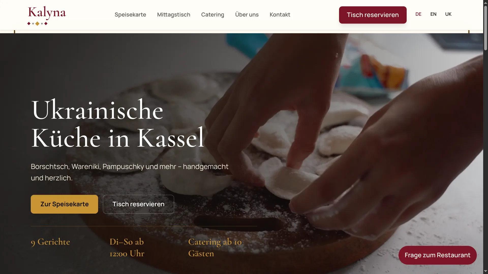
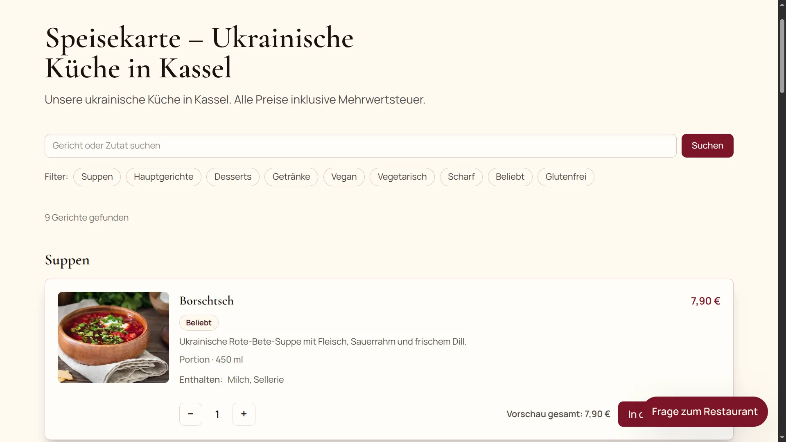
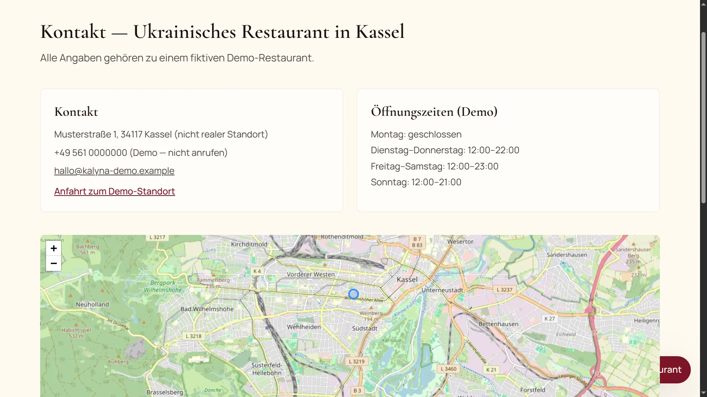
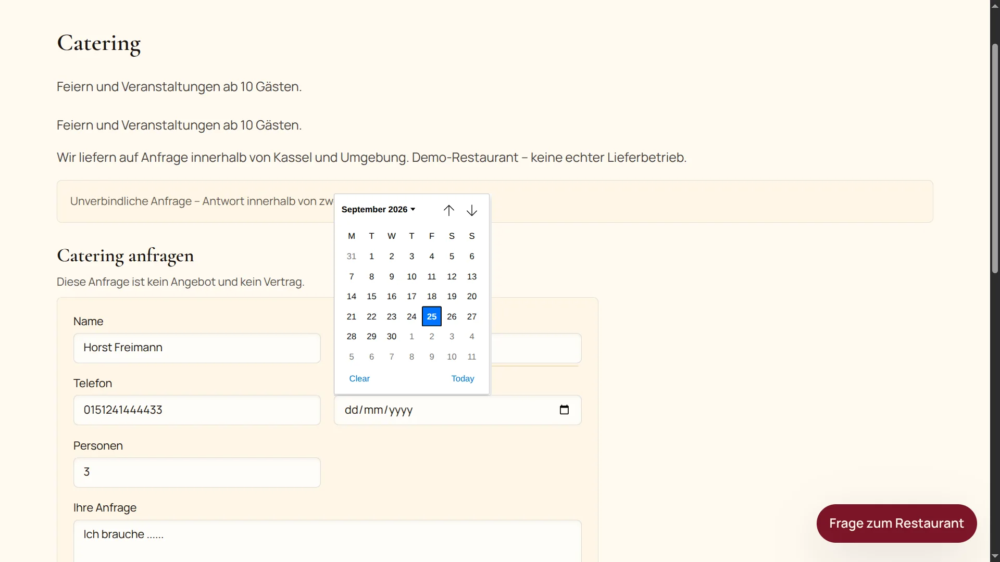
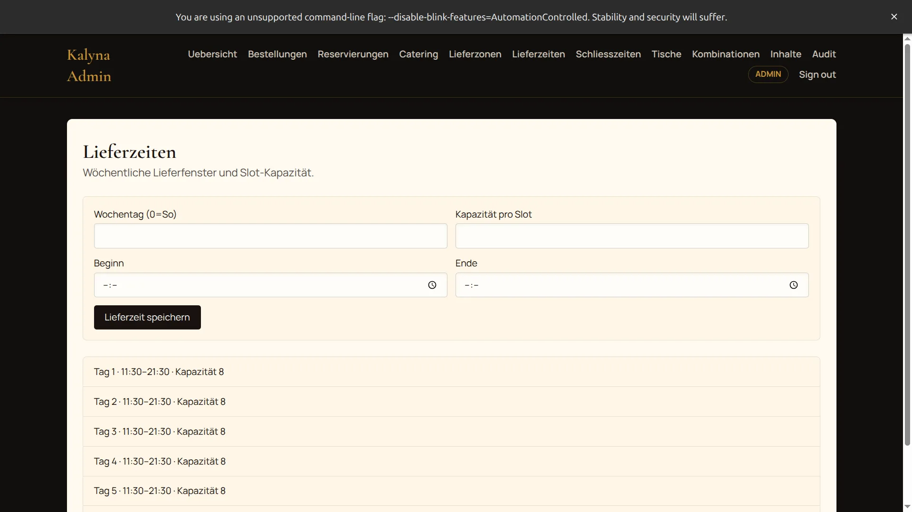
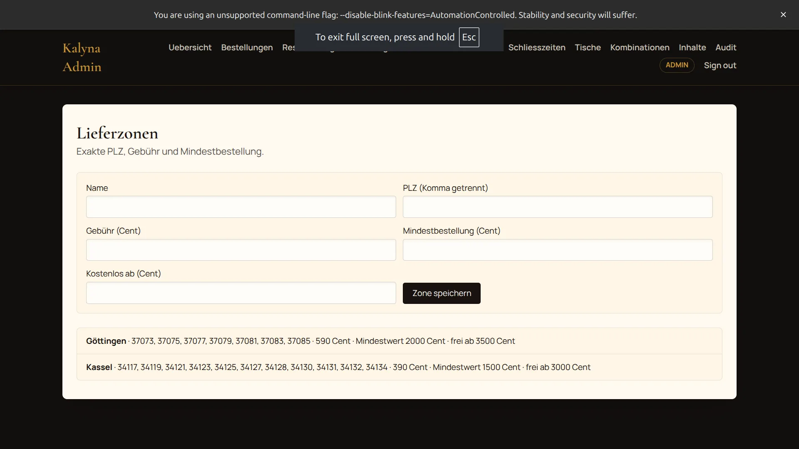
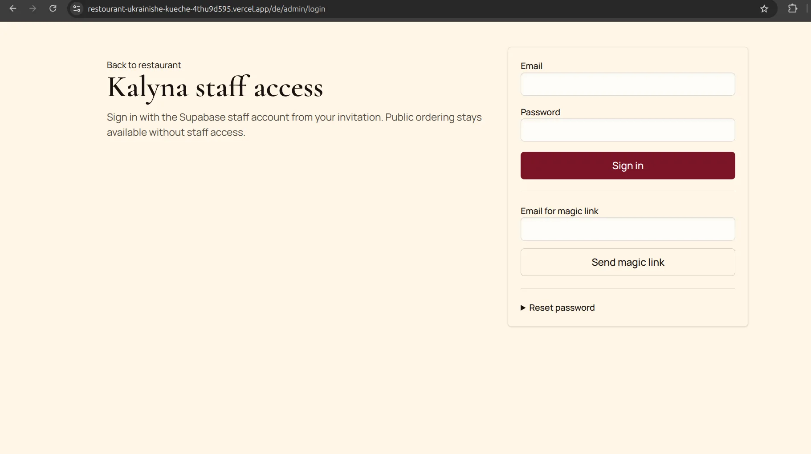

# Kalyna – Ukrainische Küche in Kassel

Kalyna ist eine produktionsnahe, mehrsprachige Full-Stack-Webplattform für ein fiktives ukrainisches Restaurant in Kassel. Das Projekt ist eine Portfolio-Demo: Es zeigt Architektur, Engineering-Praxis und einen realistischen e-commerce-ähnlichen Ablauf, ist aber kein echter Restaurantbetrieb.

Die Anwendung deckt öffentliche Restaurantseiten, eine lokalisierte Speisekarte, Warenkorb und Checkout, Reservierungen, Catering-Anfragen, Gutscheine, einen Personal-/Adminbereich, transaktionale E-Mails, Stripe-Testzahlungen und einen lesenden KI-Assistenten ab.

> **Demo-Hinweis:** Kalyna ist ein Demo-Restaurant. Kontaktdaten, Verfügbarkeiten, Rechtstexte und Zahlungen dürfen nicht als echter Geschäftsbetrieb dargestellt werden. Stripe läuft ausschließlich im Testmodus. Deutsch ist die kanonische Inhaltssprache; Englisch und Ukrainisch dürfen feldweise auf Deutsch zurückfallen.

## Screenshots

<table>
  <tr>
    <td width="50%" valign="top">
      
      <br><sub><strong>Startseite</strong> – Hero mit Speisekarten-CTA, Tischreservierung und Zugriff auf den KI-Assistenten.</sub>
    </td>
    <td width="50%" valign="top">
      
      <br><sub><strong>KI-Assistent</strong> – geöffneter Dialog auf der Startseite.</sub>
    </td>
  </tr>
  <tr>
    <td width="50%" valign="top">
      
      <br><sub><strong>Speisekarte</strong> – Kategorien, Filter, Allergene und verfügbare Gerichte mit Preisen.</sub>
    </td>
    <td width="50%" valign="top">
      
      <br><sub><strong>Kontakt</strong> – Öffnungszeiten, Anschrift und zustimmungsbasierte Karte.</sub>
    </td>
  </tr>
  <tr>
    <td width="50%" valign="top">
      
      <br><sub><strong>Catering</strong> – Anfrageformular mit Workflow-Status für das Personal.</sub>
    </td>
    <td width="50%" valign="top">
      
      <br><sub><strong>Admin-Dashboard</strong> – Übersicht für Bestellungen, Reservierungen und operative Abläufe.</sub>
    </td>
  </tr>
  <tr>
    <td width="50%" valign="top">
      
      <br><sub><strong>Lieferzonen</strong> – Verwaltung von Postleitzahlenzonen im Adminbereich.</sub>
    </td>
    <td width="50%" valign="top">
      
      <br><sub><strong>Admin-Login</strong> – Personalanmeldung über Supabase Auth.</sub>
    </td>
  </tr>
</table>

## Funktionen

### Öffentlicher Auftritt und SEO

- Lokalisierte Routen `/de`, `/en` und `/uk` mit Deutsch als kanonischem Inhalt.
- Seiten für Start, Speisekarte, Mittagstisch, Bestellung, Warenkorb, Reservierung, Catering, Gutscheine, Galerie, Events, FAQ, Kontakt, Anfahrt, Impressum, Datenschutz und AGB.
- Speisekarten-Katalog mit Kategorien, Gerichten, Modifiern, Allergenen, Zusatzstoffen, Ernährungsmerkmalen und Verfügbarkeitsstatus.
- Lokale SEO: Hreflang-Sitemap, `robots.txt`, Restaurant-JSON-LD und Metadaten pro Route.
- Legal- und Cookie-Hinweise, Impressum und Datenschutz als Demo-Rechtstexte.
- Startet ohne Datenbank mit deterministischen Demo-Inhalten; mit Datenbank direkt auf migrierten Seed-Daten.

### Bestellungen und Zahlungen

- Warenkorb im Browser ohne personenbezogene Daten; danach serverseitige Angebots- und Checkout-Validierung.
- Abholung und Lieferung mit Lieferzonen, Servicefenstern, Bestell-Snapshots und öffentlichen Status-Tokens.
- Checkout mit Stripe-Karte, Stripe-PayPal (wenn `STRIPE_PAYPAL_ENABLED=true`) oder Barzahlung.
- Signaturgeprüfte und idempotente Stripe-Webhooks; Browser-Weiterleitungen markieren nie eine Zahlung als bezahlt.
- Vollständige Rückerstattungen für abgeschlossene Online-Zahlungen.
- Rabatt-Promocodes neben separaten Gutscheinprodukten; Preise werden immer serverseitig in ganzen Euro-Cents neu berechnet.
- Jede neue Bestellung erfordert die Annahme durch das Restaurant.

### Reservierungen und Gastkommunikation

- Reservierungsanfragen mit Verfügbarkeitsprüfung, Slots, Tischzuweisung, Tisch-Kombinationen und Haltefristen.
- Öffentliche Storno-Tokens statt Kundenkonten.
- „Meine Anfragen“-Seite: Gäste sehen eigene Bestellungen und Reservierungen über die Telefonnummer.
- Catering-Anfrageformular mit Workflow-Status und Personalbenachrichtigung.

### Personal- und Adminbereich

- Rollenbasierte Zugriffskontrolle mit `ADMIN`, `MANAGER` und `STAFF`.
- Admin-Seiten für Übersicht, Bestellungen, Reservierungen, Catering, Lieferzonen, Lieferzeiten, Schließzeiten, Tische, Tisch-Kombinationen, Inhalte und Audit-Log.
- Audit-Trail für sensible Admin-Aktionen, „Audit“ ist nur für `ADMIN` sichtbar.
- Personalanmeldung und Sitzungen über Supabase Auth; operative Daten laufen über einen direkten PostgreSQL-Pool (`DATABASE_URL`).

### Inhalte, E-Mail und KI

- Typisiertes CMS-ähnliches Content-Management für öffentliche Seiten und Content-Editor im Adminbereich.
- E-Mail-Outbox mit retry-orientierter Hintergrundverarbeitung über einen Notification-Service (Brevo-Adapter).
- Leaflet-Karte, die erst nach Zustimmung/Konfiguration geladen wird.
- Lesender KI-Assistent mit allowlisted Tools für Speisekarte, Öffnungszeiten, Liefergebühr, Reservierungsverfügbarkeit und FAQ-Daten.
- KI-Antworten mit PII-Ablehnung, IP-/Session-Rate-Limit, Monatsbudget-Gate und 5-Tage-Geschichtsaufbewahrung; Aufräum-Job hinter `CRON_SECRET`.
- Der KI-Assistent gibt keine rechtlichen, medizinischen, ernährungsbezogenen oder allergenbezogenen Garantien.

## Tech Stack

| Bereich | Technologie |
| --- | --- |
| Framework | Next.js 16 (App Router, Server Components) |
| UI-Runtime | React 19 |
| Sprache | TypeScript 5.8 |
| Styling | Tailwind CSS 4 mit CSS-Design-Tokens |
| Lokalisierung | `next-intl` (`de`/`en`/`uk`) |
| Datenbank | PostgreSQL mit direkten SQL-Migrationen und `pg`-Pool |
| Auth | Supabase Auth (JWT-Sessions) |
| Datenzugriff (Admin/Staff) | PostgreSQL-Pool über `DATABASE_URL`, Pool-first für alle operativen Lese-/Schreibpfade |
| Zahlungen | Stripe Checkout und signierte Webhooks (Testmodus) |
| E-Mail | Brevo-Adapter hinter einem Notification-Service |
| Karten | Leaflet, nur nach Zustimmung/Konfiguration |
| Validierung | Zod an externen Grenzen |
| Tests | Vitest Unit- und PostgreSQL-Integrationstests |
| CI | GitHub Actions: Lint, Typecheck, Unit-, Integrationstests und Build |
| Deployment-Ziel | Vercel + Supabase EU |

## Funktionale Betriebsmodi

1. **Öffentliche Demo ohne Datenbank** – `NEXT_PUBLIC_DEMO=true` (Standard): öffentliche Seiten nutzen deterministische Demo-Fixtures für Speisekarte und Inhalte.
2. **Öffentliche Demo mit lokaler Datenbank** – `NEXT_PUBLIC_DEMO=false` + `DATABASE_URL`, Migrationen und Seeds anwenden.
3. **Personal-/Adminbereich** – Supabase-Auth-Konfiguration plus `DATABASE_URL` für operative Daten.
4. **Provider-Funktionen** – Stripe, Brevo, E-Mail-Outbox und KI nur mit den jeweiligen Schlüsseln; ohne Konfiguration schlagen diese Pfade kontrolliert fehl.

## Voraussetzungen

- Node.js `>=22`
- npm mit committeter `package-lock.json`
- PostgreSQL für lokale datenbankgestützte Entwicklung und Integrationstests
- Optionale Provider-Accounts für Supabase, Stripe, Brevo und KI-Funktionen

## Schnellstart

```sh
npm ci
cp .env.example .env.local
npm run dev
```

Die lokale Next.js-URL gibt der Dev-Server aus, üblicherweise `http://localhost:3000`. In dieser Standardkonfiguration (`NEXT_PUBLIC_DEMO=true`) läuft die öffentliche Demo ohne Datenbank.

Für die datenbankgestützte Demo eine lokale Datenbank anlegen und `NEXT_PUBLIC_DEMO=false` setzen:

```sh
createdb kalyna_dev

# .env.local
DATABASE_URL=postgresql://<user>@localhost:5432/kalyna_dev
QUOTE_SIGNING_SECRET=<lokales-geheimnis-mit-mindestens-32-zeichen>
NEXT_PUBLIC_DEMO=false
```

Danach:

```sh
npm run db:local:migrate
npm run db:local:seed
```

PostgreSQL über Unix-Socket funktioniert ebenfalls: `DATABASE_URL=postgresql://<user>@/kalyna_dev?host=/var/run/postgresql`.

## Umgebungsvariablen

`.env.example` enthält nur Variablennamen, keine echten Werte. Server-Secrets werden über `src/lib/env/server.ts` gelesen und mit `server-only` geschützt; Browser-Code erhält nur `NEXT_PUBLIC_*`-Werte.

| Gruppe | Variable | Zweck / Bedingung |
| --- | --- | --- |
| Allgemein | `NODE_ENV`, `APP_ENV` | Laufzeit- und Umgebungsmodus |
| Allgemein | `URL` | Basis-URL für Supabase-E-Mail-Links und E-Mail-Outbox in Deployments |
| Datenbank | `DATABASE_URL` | Operative Datenbank; nötig für alle rechnenden und admin-/staff-nahen Pfade |
| Datenbank | `TEST_DATABASE_URL` | Dedizierte Testdatenbank (`kalyna_test`), nur für Tests |
| Quote | `QUOTE_SIGNING_SECRET` | Signierschlüssel für serverseitige Angebote (min. 32 Zeichen) |
| Supabase | `SUPABASE_URL`, `SUPABASE_SERVICE_ROLE_KEY` | Server-only Auth zu Supabase |
| Supabase | `NEXT_PUBLIC_SUPABASE_URL`, `NEXT_PUBLIC_SUPABASE_ANON_KEY` | Client-sichere Supabase-Konfiguration für `/admin/login` |
| Stripe | `STRIPE_SECRET_KEY` | Stripe Test Secret Key |
| Stripe | `STRIPE_WEBHOOK_SECRET` | Secret für die Webhook-Signaturprüfung |
| Stripe | `STRIPE_PAYPAL_ENABLED` | Optional, aktiviert Stripe-PayPal im Checkout (Standard: `false`) |
| E-Mail | `BREVO_API_KEY` | Key für den transaktionalen E-Mail-Provider |
| KI | `GROQ_API_KEY` | Groq API-Key für den KI-Assistenten |
| KI | `GROQ_MODEL` | Optional, Standard: `openai/gpt-oss-120b` |
| KI | `AI_PROVIDER_KEY` | Alternativer Provider-Key; ohne Budget-Grenze schlagen bezahlte KI-Aufrufe fehl |
| KI | `AI_MONTHLY_BUDGET_EUR` | Monatliche Budgetgrenze für KI-Nutzung |
| Cron | `CRON_SECRET` | Secret für geschützte Cron-Endpunkte |
| Bootstrap | `BOOTSTRAP_ADMIN_AUTH_USER_ID`, `BOOTSTRAP_ADMIN_DISPLAY_NAME` | Supabase-Auth-User und Anzeigename für `db:bootstrap-admin` |
| Browser | `NEXT_PUBLIC_DEMO` | `true` = Demo-Fixtures für öffentliche Inhalte (Standard), `false` = Datenbankinhalt |

## Datenbank und Tests

Das Projekt nutzt direkte SQL-Migrationen statt eines ORMs. Migrationen liegen in `db/migrations/`, Seeds in `db/seeds/`.

Lokale Entwicklungsdatenbank:

```sh
createdb kalyna_dev
npm run db:local:migrate
npm run db:local:seed
```

Die `db:local:*`-Skripte akzeptieren nur eine lokale Datenbank namens `kalyna_dev`. `db:bootstrap-admin` erwartet `DATABASE_URL` sowie `BOOTSTRAP_ADMIN_AUTH_USER_ID` (eine Supabase-Auth-User-ID) und legt das erste ADMIN-Profil an.

Integrationstests brauchen eine eigene lokale Datenbank `kalyna_test`:

```sh
createdb kalyna_test
```

`.env.test.local`:

```dotenv
APP_ENV=test
TEST_DATABASE_URL=postgresql://<user>@localhost:5432/kalyna_test
```

Unix-Socket-Variante: `TEST_DATABASE_URL=postgresql://<user>@/kalyna_test?host=/var/run/postgresql`.

Test-Schema und Seeds:

```sh
npm run db:migrate
npm run db:seed
```

`npm run db:reset` entfernt Test-Schemas, nicht die Datenbank selbst. Die Fuse-Prüfung in `src/lib/db/fuse.ts` verhindert, dass Tests Entwicklungs-, Produktions- oder gehostete Supabase-Daten berühren.

## Skripte

| Befehl | Beschreibung |
| --- | --- |
| `npm run dev` | Lokalen Next.js-Dev-Server starten |
| `npm run build` | Produktions-Build erstellen |
| `npm run start` | Produktionsserver nach dem Build starten |
| `npm run lint` | ESLint ausführen |
| `npm run typecheck` | `tsc --noEmit` ausführen |
| `npm run test:unit` | Unit-Tests ausführen |
| `npm run test:integration` | Integrationstests ohne Datei-Parallelisierung ausführen |
| `npm run test` | Unit- und Integrationstests ausführen |
| `npm run check` | Lint, Typecheck und alle Tests ausführen |
| `npm run test:e2e` | Reservierter E2E-Einstiegspunkt; Playwright ist aktuell noch nicht als Abhängigkeit konfiguriert |
| `npm run db:reset` | Test-Schemas entfernen |
| `npm run db:migrate` | Testmigrationen und Rollen-Bootstrap anwenden |
| `npm run db:seed` | Testdatenbank befüllen |
| `npm run db:local:migrate` | Lokale Entwicklungsmigrationen anwenden |
| `npm run db:local:seed` | Lokale Entwicklungsdatenbank befüllen |
| `npm run db:bootstrap-admin` | Personal-/Admin-Profil bootstrappen |

## Qualität

- Server Components als Standard; Client Components nur für Browser-APIs und Interaktion.
- Featurebasierte Colocation unter `src/features/`; keine Barrel-Exports, kein `any`.
- Externe Grenzen werden mit Zod validiert.
- Die vollständige Qualitäts-Pipeline ist `npm run check` und zusätzlich `npm run build` sowie `npm audit --omit=dev`.
- CI führt Lint, Typecheck, Unit-, Integrationstests und Build in einem eigenen PostgreSQL-16-Service aus.
- Tests schlagen sofort fehl, wenn ihre Datenbank-URL Entwicklungs- oder Produktionsdaten entspricht.

## Sicherheitsmodell

- Öffentliche Browser-Mutationen schreiben nicht direkt in private operative Tabellen.
- Preise werden serverseitig in ganzen Euro-Cents neu berechnet; Browser-Werte werden nie übernommen.
- Öffentliche Bestell- und Reservierungsseiten nutzen undurchsichtige Tokens; Token-Seiten sind für `noindex`/`no-store` vorgesehen.
- Stripe-Webhooks werden signaturgeprüft und idempotent verarbeitet.
- Personalrechte werden über Rollenprüfungen und Datenbank-Policies abgesichert.
- Secrets, öffentliche Tokens, vollständige Adressen, E-Mails, Telefonnummern und KI-Prompts mit personenbezogenen Daten werden nicht geloggt.
- Der KI-Assistent ist allowlisted und nur lesend; PII wird abgelehnt.
- Sicherheits-Header (CSP, HSTS in Produktion) und zustimmungsbasierte Karten-/Cookie-Funktionen sind umgesetzt.
- `prefers-reduced-motion` wird respektiert; Animationen nutzen CSS, nicht Framer Motion.

## Projektstruktur

```text
src/
  app/                         Next.js-Routen, Layouts und Route Handler
    [locale]/(public)/         lokalisierte öffentliche Website-Seiten
    [locale]/(admin)/admin/    Personal- und Admin-Dashboard-Seiten
    [locale]/(auth)/admin/     Admin-Login und Passwortseiten
    api/                       KI-, Cron- und Stripe-Webhook-Routen
  features/                    featurebasierte Anwendungsmodule
    ai/                        Assistenten-Historie, Tools und Launcher
    admin/                     operative Einstellungen und Schließzeiten
    cart/                      lokaler Warenkorb-Domaincode und UI
    catering/                  Catering-Anfragen und Personalsteuerung
    contact/                   Öffnungszeiten und Kontaktkomponenten
    content/                   typisierte Inhalte, Public Chrome und Editor-UI
    delivery/                  Lieferfenster und Lieferzonen
    guest/                     Gastsuche für eigene Anfragen
    identity/                  Personal-Auth, Rollen und Sessions
    menu/                      Katalog-Domain, Stores und Menü-UI
    notifications/             E-Mail- und Outbox-Services
    order/                     Bestelldomain, Checkout und Personalaktionen
    payments/                  Stripe Checkout, Webhooks und Rückerstattungen
    quote/                     serverseitige Angebotsberechnung
    reservation/               Slots, Verfügbarkeit, Tische und Workflows
    seo/                       Metadata-, Sitemap- und JSON-LD-Helfer
    vouchers/                  Gutschein-Domain und Kaufformular
  i18n/                        Routing, Navigation und Message-Loading
  lib/                         gemeinsame DB-, Env-, Logger- und Supabase-Utilities
  messages/                    de/en/uk-Übersetzungsdateien

db/
  migrations/                  geordnete SQL-Migrationen
  seeds/                       deterministische Demo- und Testdaten

docs/
  screenshots/                 komprimierte README-Screenshots

public/                        Bilder, Logo und Hero-Video-Assets
tests/
  unit/                        schnelle Domain- und Helper-Tests
  integration/                 PostgreSQL-gestützte Integrationstests
scripts/                       Datenbank- und Admin-Bootstrap-Skripte
```

## Dokumentation

Die SDD-/TDD-Artefakte (`docs/sdd/`, `docs/tdd/`) sind bewusst lokale Entwicklungsunterlagen und durch `.gitignore` vom Repository ausgeschlossen. Sie werden nicht in ein frisches Klon ausgeliefert. Lokal liegen dort unter anderem `spec.md`, `architecture.md`, `database-schema.md` und die Tickets unter `tickets/`.

## Deployment-Hinweise

Deployment-Ziel ist Vercel mit Supabase-EU-Projekten. Entwicklung, Test und Produktion nutzen getrennte Umgebungen. Previews und Produktion bleiben im Stripe-Testmodus, bis ein realer Betreiber, echte rechtliche Daten und eine Live-Zahlungsfreigabe existieren.

Vor dem Deployment müssen die Supabase-Auth-Redirects so konfiguriert sein, dass Invite-, Magic-Login- und Passwort-Reset-Links nach `/auth/callback` zurückkehren, und in Produktion sind `URL`, Supabase-, Stripe- und ggf. Brevo-/KI-Variablen vollständig zu setzen.